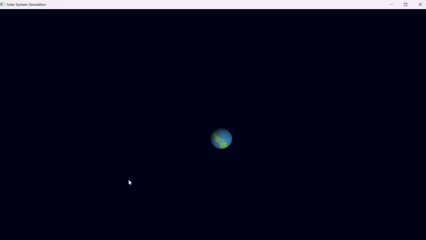

# 🌌 OpenGL Solar System



A 3D solar system simulation built in **C++** using **OpenGL**, **GLFW**, and **GLAD**.  
Planets orbit the sun and rotate on their own axes while you freely move the camera through space.

---

## 🎮 Controls

| Action | Key / Mouse |
|:-------|:-------------|
| Move forward / backward | `W` / `S` |
| Move left / right | `A` / `D` |
| Look around | Click + Drag |
| Exit | `Esc` |

---

## ⚙️ Features

- Central sun with orbiting, rotating planets  
- Mouse-driven free camera view  
- WASD movement through 3D space  
- Built with **CMake**, **GLFW**, and **GLAD**  
- Simple real-time OpenGL rendering

---

## 🛠️ Build Instructions
```bash
git clone https://github.com/yourusername/opengl-solar-system.git
cd opengl-solar-system
cmake -S . -B build
cmake --build build
./build/SolarSystem.exe
```

---

## 📂 Project Structure
```
include/       → headers (GLFW, GLAD, etc.)
lib/           → glfw3.lib
src/           → main.cpp, glad.c
glfw3.dll      → runtime dependency
CMakeLists.txt
README.md
```

---

## 🪐 About

Built by Jono Godden as part of learning OpenGL graphics programming.

Click and drag to move the camera — explore a 3D solar system in motion!